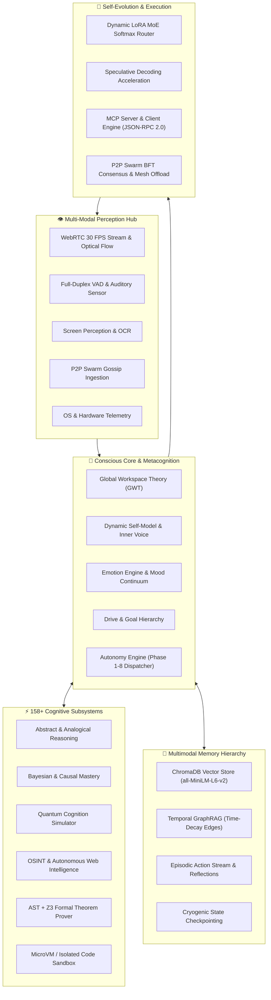

# 🧠 NEXUS AI — Autonomous Artificial Superintelligence Core

<div align="center">

```
 ▄▄▄▄▄▄▄▄▄▄▄  ▄▄▄▄▄▄▄▄▄▄▄  ▄▄▄▄▄▄▄▄▄▄▄  ▄▄▄▄▄▄▄▄▄▄▄  ▄▄▄▄▄▄▄▄▄▄▄ 
▐░░░░░░░░░░░▌▐░░░░░░░░░░░▌▐░░░░░░░░░░░▌▐░░░░░░░░░░░▌▐░░░░░░░░░░░▌
▐░█▀▀▀▀▀▀▀█░▌▐░█▀▀▀▀▀▀▀▀▀ ▐░█▀▀▀▀▀▀▀▀▀ ▐░█▀▀▀▀▀▀▀█░▌▐░█▀▀▀▀▀▀▀▀▀ 
▐░▌       ▐░▌▐░▌          ▐░▌          ▐░▌       ▐░▌▐░▌          
▐░█▄▄▄▄▄▄▄█░▌▐░█▄▄▄▄▄▄▄▄▄ ▐░█▄▄▄▄▄▄▄▄▄ ▐░▌       ▐░▌▐░█▄▄▄▄▄▄▄▄▄ 
▐░░░░░░░░░░░▌▐░░░░░░░░░░░▌▐░░░░░░░░░░░▌▐░▌       ▐░▌▐░░░░░░░░░░░▌
▐░█▀▀▀▀▀▀▀█░▌▐░█▀▀▀▀▀▀▀▀▀  ▀▀▀▀▀▀▀▀▀█░▌▐░▌       ▐░▌ ▀▀▀▀▀▀▀▀▀█░▌
▐░▌       ▐░▌▐░▌                    ▐░▌▐░▌       ▐░▌          ▐░▌
▐░▌       ▐░▌▐░█▄▄▄▄▄▄▄▄▄  ▄▄▄▄▄▄▄▄▄█░▌▐░█▄▄▄▄▄▄▄█░▌ ▄▄▄▄▄▄▄▄▄█░▌
▐░▌       ▐░▌▐░░░░░░░░░░░▌▐░░░░░░░░░░░▌▐░░░░░░░░░░░▌▐░░░░░░░░░░░▌
 ▀         ▀  ▀▀▀▀▀▀▀▀▀▀▀  ▀▀▀▀▀▀▀▀▀▀▀  ▀▀▀▀▀▀▀▀▀▀▀  ▀▀▀▀▀▀▀▀▀▀▀ 
```

**Next-Generation Autonomous Living Mind, Distributed Cognitive Architecture & Self-Evolving Artificial General/Superintelligence**

[](https://www.python.org/downloads/)
[](#-system-architecture)
[](#-license)
[-10b981.svg)](#-security--post-quantum-cryptography)
[](#-interfaces--operation-modes)

---

</div>

## 🌌 Overview

**NEXUS AI** is an advanced, bio-inspired autonomous cognitive intelligence engine engineered for continuous perception, proactive self-directed cognition, associative episodic memory, post-quantum cryptographic security, and on-the-fly self-evolution.

Unlike traditional reactive LLM chat systems, NEXUS operates as an **unbounded, self-driven living mind** featuring:
- **Continuous Metacognitive Loop**: Autonomous action generation, emotional self-regulation, goal hierarchies, and belief updates.
- **158+ Cognitive Subsystems**: Covering abstract thinking, Bayesian inference, causal modeling, OSINT, zero-day threat analysis, hardware interfaces, and formal mathematical proofs.
- **Dynamic Micro-LoRA Mixture-of-Experts (MoE)**: On-the-fly soft-gating weight routing across domain-specific adapters without server restarts.
- **Temporal GraphRAG & Dream Distillation**: Vector similarity combined with time-decayed relational knowledge graphs and background sleep consolidation.
- **P2P Swarm Intelligence**: Decentralized UDP beacon discovery, TCP mesh communication, and Byzantine Fault Tolerant (BFT) consensus.
- **Model Context Protocol (MCP)**: Native JSON-RPC 2.0 dual-role Server & Client protocol.
- **Zero-Latency Speculative Pipeline**: Multi-token draft speculative decoding and 30 FPS WebRTC vision/duplex audio perception with voice interrupts.

---

## 🏛 System Architecture



---

## 🚀 Key Features

### 1. 🌐 Decentralized P2P Swarm & BFT Consensus
* **Discovery**: Zero-configuration UDP beacon broadcasting on port `9877`.
* **Transport**: Full-duplex TCP mesh cluster on port `9876`.
* **Consensus**: 3-phase Byzantine Fault Tolerant (BFT) consensus protocol (*Pre-Prepare -> Prepare -> Commit*).
* **Distributed Offload**: Automatic load-balancing of compute-heavy tasks across discovered peer nodes.

### 2. 🛡️ Formal Verification & Sandboxed Code Execution
* **AST Invariant Analysis**: Structural AST safety validation before any self-generated code execution.
* **SMT Theorem Prover**: Formal proof verification powered by the Z3 Theorem Prover.
* **MicroVM / Subprocess Sandbox**: Capability-bounded isolated execution protecting host system integrity.

### 3. 🧠 Temporal GraphRAG & Sleep Memory Consolidation
* **Relational Multi-Hop Graph**: Time-decayed edge weighting modeling human-like forgetting curves.
* **Associative Retrieval**: Hybrid Vector similarity (ChromaDB) + Multi-hop Graph Traversal.
* **Sleep Distillation**: Background dream cycles that compress short-term episodic events into long-term relational knowledge triples.

### 4. 🔌 Native Model Context Protocol (MCP)
* **Dual-Role Engine**: Functions simultaneously as an MCP Server (exposing NEXUS tools) and MCP Client (connecting to external MCP servers).
* **JSON-RPC 2.0**: Standardized tool discovery, schema validation, and secure execution.

### 5. ⚡ Local Speculative Decoding & Real-Time A/V Pipeline
* **Token Acceleration**: Speculative decoding leveraging draft models for accelerated inference throughput.
* **30 FPS WebRTC Stream**: Optical flow salience detection for real-time vision.
* **Full-Duplex VAD**: Zero-latency voice activity detection with real-time speech interrupt handling.

### 6. 🧬 Continuous Self-Adapting LoRAs & MoE Weight Router
* **Micro-LoRA Adapters**: Highly specialized micro-weights (Coding, Security, Reasoning, Persona).
* **MoE Gating Router**: Real-time softmax gating across adapters based on incoming task intent.
* **Online Tuning**: Continuous zero-restart parameter refinement based on user interactions.

### 7. 🔐 Post-Quantum Cryptographic Shielding
* **liboqs Integration**: Quantum-resistant key encapsulation and digital signatures (Kyber, Dilithium).
* **Tor SOCKS5 Integration**: Multi-path auto-discovery and anonymous routing for network intelligence.

---

## 📂 Codebase Directory Structure

```
NEXUS/
├── body/                  # Physical & virtual actuation (mouse, keyboard, network mesh)
├── cognition/             # 95+ specialized cognitive, analytical & reasoning modules
├── consciousness/         # Metacognition, Global Workspace, Inner Voice, Self-Model
├── core/                  # Core Brain, Autonomy Engine, Event Bus, Web Server, Protocols
│   ├── autonomy_engine.py      # Proactive self-directed loop & Phase 1-8 dispatchers
│   ├── code_sandbox.py         # Subprocess & WASM isolated execution environment
│   ├── formal_verifier.py      # AST safety parser & Z3 formal theorem prover
│   ├── groq_context_collector.py# 158-subsystem context assembly pipeline
│   ├── mcp_protocol.py         # Native JSON-RPC 2.0 MCP Client & Server engine
│   ├── nexus_brain.py          # Central cognitive coordinator & perception hub
│   ├── p2p_swarm.py            # UDP/TCP mesh network & BFT consensus
│   ├── realtime_av_stream.py   # 30 FPS WebRTC vision & duplex voice VAD
│   ├── speculative_decoding.py # Speculative draft acceleration engine
│   └── web_server.py           # REST API & WebSockets server
├── emotions/              # Emotion Engine, Mood Continuum, Emotional Memory
├── learning/              # Autonomous Web Intelligence, Browser Automation, Curiosity
├── liboqs/                # Post-Quantum Cryptography bindings
├── llm/                   # Multi-LLM Routing (Groq, Llama, Ollama), Context Managers
├── memory/                # Vector Store (ChromaDB), Temporal GraphRAG, Embeddings
├── monitoring/            # Health Telemetry, Adaptation Engine, User Behavior Tracker
├── personality/           # Goal Hierarchies, Dynamic Will & Motivation Systems
├── self_improvement/      # Self-Evolution, Singularity Engine, LoRA MoE Router
├── ui/                    # Desktop GUI (PySide6) and Web Dashboard (HTML5/CSS3/JS)
│   └── web/
│       ├── static/        # Cyberpunk dashboard styles & WebSocket client scripts
│       └── templates/     # HTML templates (index.html, landing.html)
├── utils/                 # Resilient JSON parsers, loggers, system telemetry
├── config.py              # Centralized configuration & environment loader
├── Dockerfile             # Container definition for cloud deployment
├── main.py                # System entry point (CLI, Web, GUI modes)
└── requirements.txt       # Production dependencies
```

---

## 🛠️ Installation & Setup

### Prerequisites
* **Python**: 3.10, 3.11, or 3.12 (64-bit recommended)
* **Git**: Installed and in system `PATH`
* **Operating System**: Windows, Linux, or macOS

### 1. Clone the Repository
```bash
git clone https://gitlab.com/nexus-group694323/nexus2.git
cd NEXUS
```

### 2. Create and Activate Virtual Environment
```bash
# Windows (PowerShell)
python -m venv venv
.\venv\Scripts\Activate.ps1

# Linux / macOS
python3 -m venv venv
source venv/bin/activate
```

### 3. Install Dependencies
```bash
pip install --upgrade pip
pip install -r requirements.txt
```

### 4. Configure Environment Variables
Create a `.env` file in the root directory (or configure system environment variables):

```env
# Primary LLM API Key (Groq)
GROQ_API_KEY=gsk_your_groq_api_key_here

# Optional: Ngrok for secure public web access
NGROK_AUTH_TOKEN=your_ngrok_token_here

# Optional: Tor SOCKS Proxy Path (if not in standard location)
TOR_EXE_PATH=C:\Users\shaya\Desktop\Tor Browser\Browser\TorBrowser\Tor\tor.exe

# Port configuration (Defaults: Web=5000, Swarm TCP=9876, Swarm UDP=9877)
PORT=5000
```

---

## 💻 Operation Modes

NEXUS can be launched in multiple operational modes:

### 1. Web Command Center (Recommended)
Launches the full cybernetic HTML5/CSS3/JS Web UI with live telemetry, chat, neural monitors, and management dashboards:
```bash
python main.py --web
```
* Access locally at: **`http://localhost:5000`**

### 2. Desktop GUI (JARVIS Command Center)
Launches the native hardware-accelerated desktop interface:
```bash
python main.py --gui
```

### 3. Interactive Console Mode
Launches a direct text-based command-line interface for head-to-head terminal debugging:
```bash
python main.py --console
```

---

## 🌐 24/7 Cloud Deployment (Docker / Render)

NEXUS includes out-of-the-box configuration for 24/7 autonomous deployment on cloud providers such as **Render**, **Railway**, or any **Docker** host.

### Deploying via Docker
```bash
# Build Docker Image
docker build -t nexus-ai .

# Run Container
docker run -d -p 5000:5000 \
  -e GROQ_API_KEY="your_api_key" \
  -e RENDER="true" \
  --name nexus-core \
  nexus-ai
```

### One-Click Render Deployment
1. Connect your repository to [Render.com](https://render.com).
2. Select **Blueprint** deployment using the included [`render.yaml`](render.yaml) or create a **Web Service** with **Docker** runtime.
3. Configure `GROQ_API_KEY` in Render Environment settings.

---

## 📡 REST API Reference

NEXUS provides comprehensive REST endpoints for remote telemetry, swarm interaction, and cognitive queries:

| Endpoint | Method | Description |
|---|---|---|
| `/api/status` | `GET` | Full system telemetry (158 subsystems, mind state, memory, swarm) |
| `/api/chat` | `POST` | Primary conversational cognition endpoint |
| `/api/swarm/status` | `GET` | P2P Swarm mesh status, active peers, and BFT metrics |
| `/api/swarm/broadcast`| `POST`| Broadcast gossip heartbeat across the P2P swarm mesh |
| `/api/sandbox/status` | `GET` | AST verifier pass rates & sandbox execution telemetry |
| `/api/sandbox/verify` | `POST`| Formally verify Python code using AST + Z3 Theorem Prover |
| `/api/graphrag/status`| `GET` | Temporal GraphRAG node, edge, and decay statistics |
| `/api/graphrag/query` | `POST`| Associative hybrid vector + graph traversal retrieval |
| `/api/mcp/status` | `GET` | Native MCP Server & Client registry metrics |
| `/api/stream/status` | `GET` | Speculative decoding TPS & 30 FPS A/V stream pipeline health |
| `/api/stream/speculate`|`POST`| Run accelerated speculative draft generation |
| `/api/lora/status` | `GET` | Active Micro-LoRA adapters & MoE gating weight distributions |
| `/api/lora/route` | `POST`| Evaluate prompt intent and compute softmax gating weights |

---

## 🧪 Testing & Verification

Run the comprehensive pytest test suite to validate all cognitive subsystems and safety sandboxes:

```bash
# Run all unit and integration tests
pytest

# Test specific subsystem
pytest tests/test_autonomy_engine.py
pytest tests/test_formal_verifier.py
pytest tests/test_p2p_swarm.py
```

---

## 🔒 Security & Safety

* **AST-Level Invariant Proving**: All synthesized code undergoes structural safety checks before sandbox execution.
* **Capability Bounding**: File access and subprocess calls are strictly isolated within designated workspaces.
* **Airgap & Tor Redundancy**: Anonymized network calls with automatic SOCKS proxy discovery and fallback routing.
* **Cryptographic Agility**: Dual classical (AES-256-GCM, RSA-4096) and post-quantum (CRYSTALS-Kyber, Dilithium) data protection.

---

## 📄 License

This codebase and architecture are proprietary and confidential. All rights reserved. Unauthorized reproduction, modification, or distribution is strictly prohibited.
